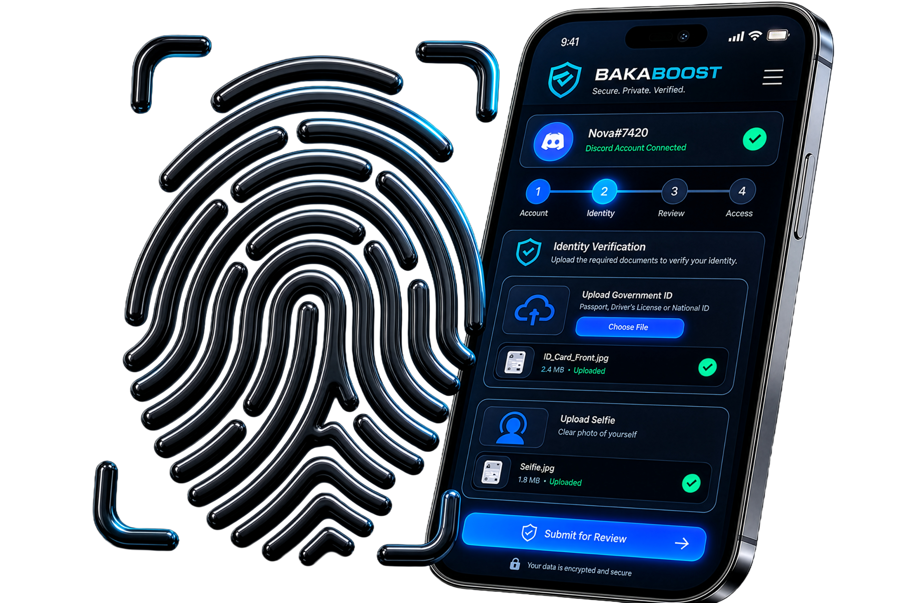
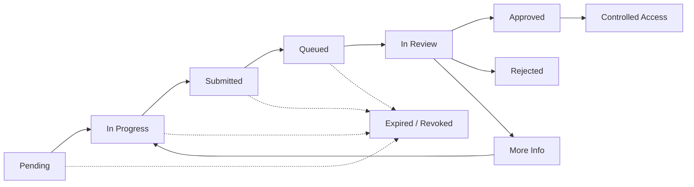
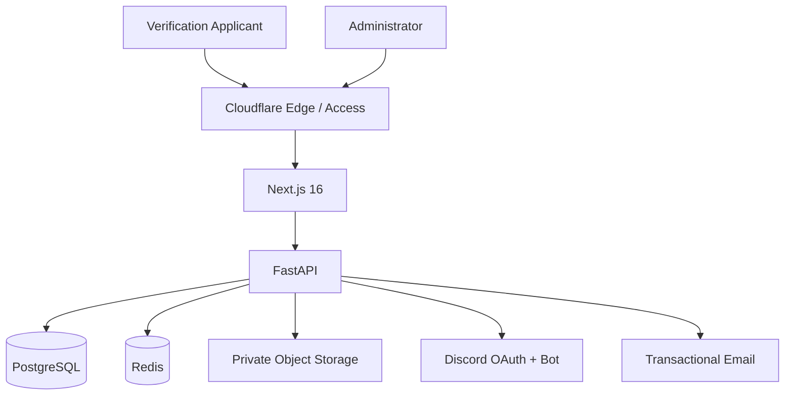
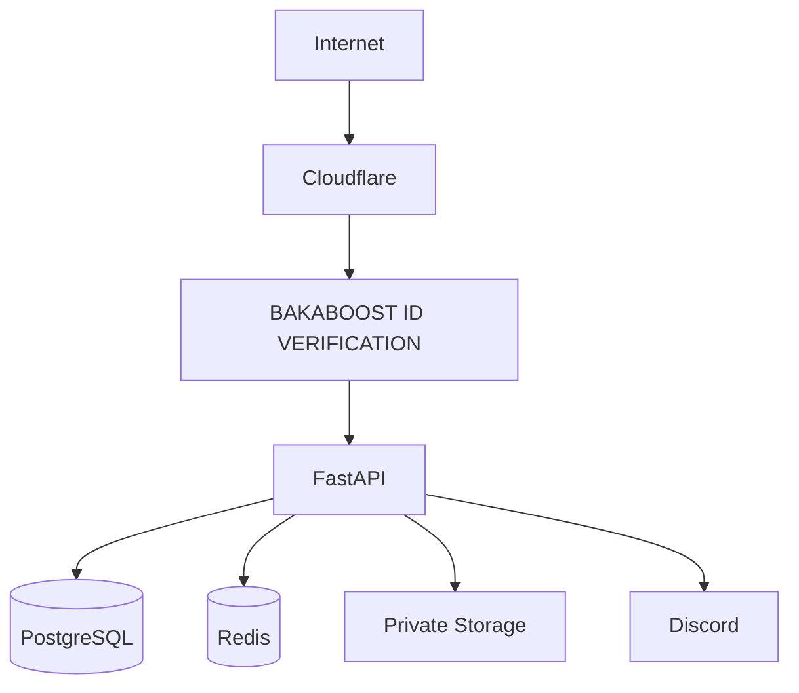

<div align="center">



# BAKABOOST ID VERIFICATION

### Identity first. Access second.

**A security-focused pre-server identity verification and controlled-access platform for Discord communities.**

<br>


<br>

**Verification Gate · Immutable Identity Binding · Manual Review · Controlled Access · Audit Trail · Admin RBAC**

</div>

---

## What is BAKABOOST ID VERIFICATION?

BAKABOOST ID VERIFICATION is a secure identity-verification gate built for protected Discord communities.

Traditional verification systems often allow somebody to enter a community **before** verification is complete.

BAKABOOST ID VERIFICATION reverses that model.

> **The applicant remains outside the protected Discord server until verification has been reviewed and approved.**

An administrator creates a private verification request for a specific Discord User ID. The applicant authenticates through Discord OAuth, the backend verifies the immutable Discord identity, evidence is submitted for manual review, and controlled Discord access can be issued only after approval.

A verification link is therefore **permission to attempt verification — not permission to enter the server.**

---

## Core Principle

```text
Verification Link
       │
       ▼
 Discord OAuth
       │
       ▼
Immutable Discord ID
       │
       ▼
Identity Evidence
       │
       ▼
  Manual Review
       │
       ▼
    Approval
       │
       ▼
Controlled Discord Access
```

### Trust boundaries

| Event | What it means |
|---|---|
| Verification link received | Permission to attempt verification |
| Discord OAuth completed | Discord account authenticated |
| User ID matched | Correct immutable identity confirmed |
| Evidence submitted | Case is ready for review |
| Administrator approves | Verification decision completed |
| Access grant consumed | Controlled Discord access completed |

---

## Verification Lifecycle



State transitions are enforced server-side rather than trusted to the browser.

---

## System Architecture



The platform separates applicant verification, administrative authorization, evidence storage and Discord access into distinct security boundaries.

---

# Verification Flow

## 01 — Private request

An authorized administrator creates a verification request for a specific Discord User ID.

The system creates a private high-entropy verification token associated with that request.

---

## 02 — Discord authentication

The applicant authenticates using Discord OAuth.

The backend compares the authenticated immutable Discord User ID with the ID assigned to the verification request.

```text
Assigned Discord ID
        │
        ├──── MATCH ────► Continue verification
        │
        └── MISMATCH ───► Access denied
```

Forwarding the verification URL therefore does not transfer the assigned identity.

---

## 03 — Evidence collection

After the Discord identity has been confirmed, the applicant can complete the configured verification requirements.

The platform contains workflows for:

- evidence upload
- evidence validation
- mobile capture
- private object storage
- verification sessions
- submission rules
- retention/deletion controls

---

## 04 — Review queue

Completed submissions enter the administrative queue.

Reviewers can work with the verification case through the dedicated administrative workspace.

The backend maintains explicit review state instead of relying on frontend state.

---

## 05 — Decision

A review can result in:

- **Approved**
- **Rejected**
- **More information required**

Security-sensitive administrative actions are recorded in the audit history.

---

## 06 — Controlled access

Approval can create a bounded Discord access grant for the same immutable Discord User ID.

The Discord integration includes access delivery and gateway-side grant reconciliation.

```text
Approved Identity
      │
      ▼
Access Grant
      │
      ▼
Exact Discord User
      │
      ▼
Discord Access
      │
      ▼
Grant Consumed
```

---

# Admin Console

BAKABOOST ID VERIFICATION contains a separate administrative experience for operating the verification system.

| Workspace | Responsibility |
|---|---|
| **Dashboard** | Administrative overview |
| **Verification Queue** | Review waiting submissions |
| **Verification Requests** | Create and manage requests |
| **Review Workspace** | Inspect evidence and make decisions |
| **Team & Access** | Administrator lifecycle |
| **Invitations** | Controlled administrator onboarding |
| **Audit Activity** | Security-sensitive event history |
| **Settings** | Administrative configuration |
| **Evidence Controls** | Evidence review and deletion |

Administrative authorization is enforced by the backend.

The application maintains its own RBAC, administrator state, sessions, CSRF protections and audit controls even when an upstream access layer is deployed.

---

# Security Architecture

BAKABOOST ID VERIFICATION follows a defense-in-depth model.

### Identity controls

- Discord OAuth authentication
- immutable Discord User ID binding
- request-specific verification tokens
- OAuth state validation
- verification-session enforcement
- explicit request lifecycle

### Administrator controls

- role-based access control
- Super Admin authority
- controlled administrator invitations
- administrator enable/disable state
- session invalidation mechanisms
- CSRF protection
- sensitive-action auditing
- Cloudflare Access integration
- MFA / step-up architecture

### Evidence controls

- private object-storage architecture
- evidence validation
- controlled evidence retrieval
- retention-policy support
- evidence deletion workflows
- temporary-upload cleanup

### Abuse controls

- verification expiration
- request revocation
- submission limits and rules
- rate-limiting infrastructure
- access-grant expiration
- bounded Discord access
- auditable state transitions

---

# Technology Stack

| Layer | Technology |
|---|---|
| **Backend** | Python · FastAPI |
| **Frontend** | Next.js 16 · React 19 · TypeScript |
| **Database** | PostgreSQL |
| **ORM** | SQLAlchemy 2 |
| **Migrations** | Alembic |
| **Security State** | Redis |
| **Discord** | OAuth2 · discord.py |
| **Object Storage** | S3-compatible private storage |
| **Edge Security** | Cloudflare Access |
| **Validation** | Pydantic |
| **HTTP Client** | HTTPX |
| **Testing** | Pytest · pytest-asyncio |
| **Backend Linting** | Ruff |
| **Frontend Linting** | ESLint |
| **Deployment** | Docker · systemd-compatible runtime |

---

# Repository Structure

```text
BAKABOOST ID VERIFICATION/
│
├── app/
│   ├── api/
│   │   └── routes/
│   │       ├── admin/
│   │       ├── auth/
│   │       └── verification/
│   │
│   ├── core/
│   ├── db/
│   ├── middleware/
│   ├── schemas/
│   │
│   └── services/
│       ├── access/
│       ├── admin/
│       ├── audit/
│       ├── discord/
│       ├── email/
│       ├── jobs/
│       ├── retention/
│       ├── security/
│       ├── storage/
│       └── verification/
│
├── frontend/
│   ├── public/
│   └── src/
│       ├── app/
│       ├── components/
│       ├── lib/
│       └── types/
│
├── migrations/
├── tests/
├── Dockerfile
├── pyproject.toml
└── README.md
```

---

# Local Development

## Requirements

Before starting, install or provide:

- Python 3.12+
- Node.js
- PostgreSQL
- Redis
- Discord OAuth application
- S3-compatible private object storage

---

## Backend

Create the virtual environment:

```bash
python3 -m venv .venv
source .venv/bin/activate
```

Install the project:

```bash
python -m pip install -e ".[dev]"
```

Create local configuration from the example:

```bash
cp .env.example .env
```

Apply migrations:

```bash
alembic upgrade head
```

Start the API:

```bash
uvicorn app.main:app --reload
```

---

## Frontend

```bash
cd frontend
npm install
npm run dev
```

The Next.js development server runs separately from the FastAPI backend.

---

# Testing

Backend quality checks:

```bash
ruff check app tests
pytest -q
```

Frontend quality checks:

```bash
cd frontend
npm run lint
npm run build
```

Security-sensitive changes should include regression coverage whenever practical.

---

# Database Migrations

Database schema changes are managed using Alembic.

Check the active migration:

```bash
alembic current
```

Apply migrations:

```bash
alembic upgrade head
```

Production migrations should always be reviewed before execution.

---

# Production Model



Production secrets should live outside the repository and be injected through the deployment environment or an appropriate secrets-management system.

Never commit:

```text
.env
.env.production
API keys
OAuth secrets
Discord bot tokens
Cloudflare API tokens
storage credentials
database passwords
administrator credentials
private keys
```

---

# Privacy

Identity evidence is sensitive information.

Deployments should apply:

- data minimization
- explicit retention periods
- restricted administrative access
- private evidence storage
- encrypted transport
- secure secret management
- appropriate deletion procedures
- applicable privacy requirements

Only evidence required for the intended verification purpose should be collected.

---

# Security Status

BAKABOOST ID VERIFICATION is under active development and security hardening.

The repository contains implemented security controls and automated regression coverage, but production security also depends on infrastructure configuration, secret management, operational procedures and deployment-specific validation.

> **A deployment should not be considered independently security-audited solely because these controls exist in the repository.**

---

# Design Principles

```text
Verification link  ≠  Discord access

Discord username   ≠  immutable identity

Evidence submitted ≠  verification approved

Approval           ≠  unrestricted invitation


Verified identity
        +
Explicit approval
        +
Controlled grant
        =
Discord access
```

---

<div align="center">

## BAKABOOST ID VERIFICATION

### Identity first. Access second.

**Secure verification for controlled Discord community onboarding.**

</div>
